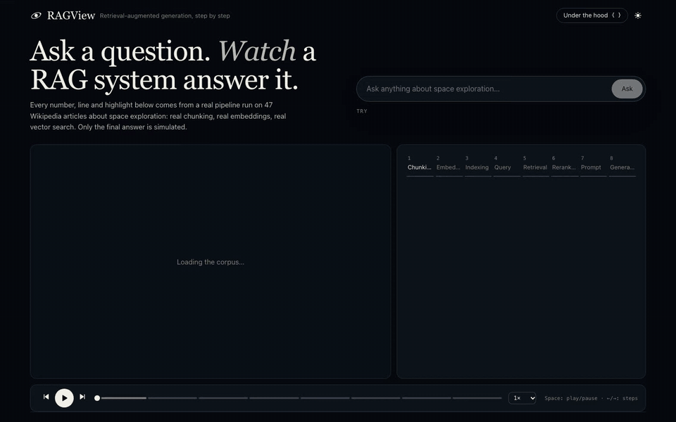
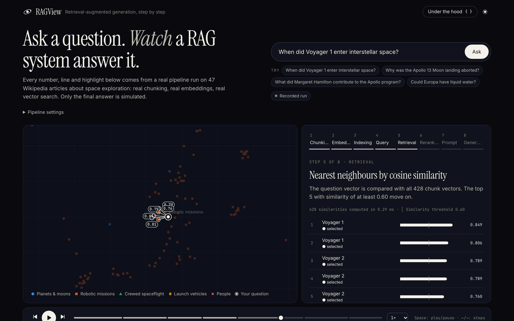
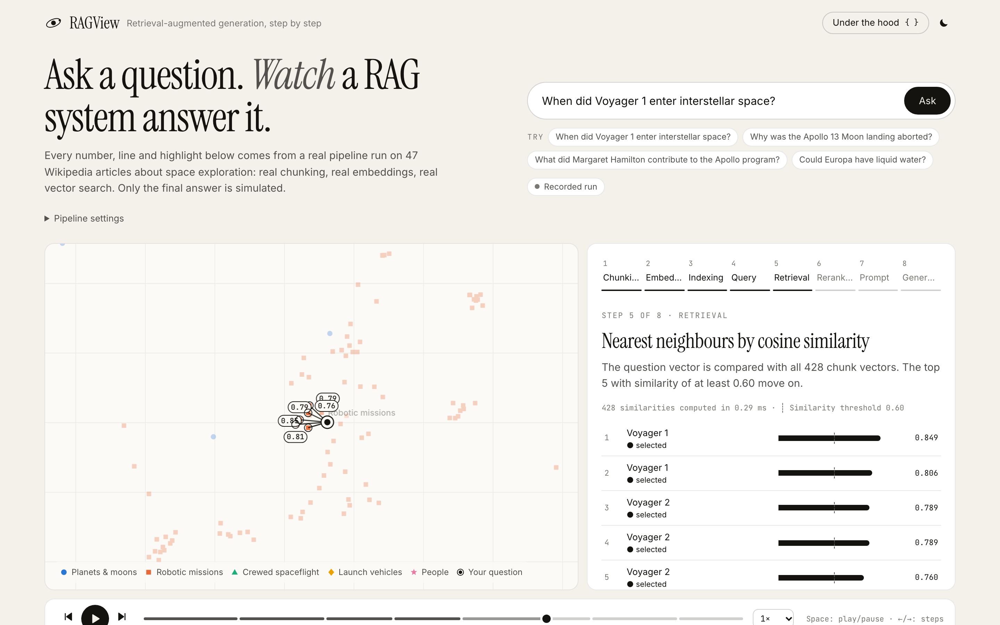
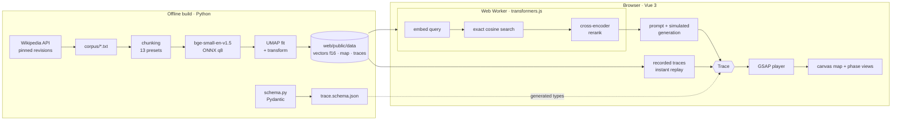

# RAGView

**Ask a question. Watch a RAG system answer it.**

RAGView is an interactive, animated walkthrough of a retrieval-augmented generation (RAG) pipeline. You ask a free-form question about a curated corpus of 47 Wikipedia articles on space exploration, and you watch each step happen: documents being chunked, chunks becoming vectors, the question landing in the same vector space, nearest neighbours being retrieved and reranked, the prompt being assembled, and the answer streaming in with citations.

The animation is never a mock-up. Every point, line, score and highlight is drawn from a typed **trace** produced by a real pipeline run. Chunking, embedding, vector search and reranking run **in your browser** with the same ONNX models the Python build uses. Only the final answer is simulated (no LLM is called; see [Generation](#generation-is-simulated-on-purpose)).



<p align="center">
  
  
</p>

## What you can do

- **Play the pipeline** step by step: play, pause, step forward and back, scrub, change the speed (keyboard: <kbd>Space</kbd>, <kbd>←</kbd> <kbd>→</kbd>). Each of the eight steps comes with a short explanation.
- **Ask anything.** The first question downloads the embedding model (34 MB, cached afterwards). Everything then runs locally: nothing is sent to a server.
- **Turn the knobs**: chunk size, overlap, sentence-aware or fixed-size splitting, top-k, similarity threshold, cross-encoder reranking. Chunks are redrawn instantly. Settings without a precomputed index are chunked and embedded in your browser, with the points appearing on the map as they are computed.
- **Compare** the grounded answer with an answer *without RAG* for the curated questions.
- **Break it on purpose** with guided failure cases: chunks too small, an ambiguous question ("Mercury": planet or NASA programme?), an out-of-corpus question, and a case where reranking rescues retrieval.
- **Look under the hood**: the JSON of every step, the full trace to download, and loading a trace back (validated against the schema).

## How it works



1. **Ingestion** (`pipeline/`, Python). `ragview fetch` downloads the articles listed in [`corpus/sources.yaml`](corpus/sources.yaml) and records the revision ids. The cleaned texts are committed, so builds are reproducible offline. `ragview build` chunks the corpus with 13 preset settings, embeds every chunk, fits UMAP on the default preset, places the others with the same fitted model, and writes everything the site needs to `web/public/data`, including recorded traces of the curated questions.
2. **The engine** (`web/src/engine/`, TypeScript). It mirrors the Python reference module by module: [`chunker.ts`](web/src/engine/chunker.ts) ↔ [`chunking.py`](pipeline/src/ragview/chunking.py), [`pipeline.ts`](web/src/engine/pipeline.ts) ↔ [`engine.py`](pipeline/src/ragview/engine.py), and so on. Models run in a Web Worker through transformers.js, loading the **same `model_quantized.onnx` files** that Python loads with onnxruntime.
3. **The trace** is the contract. [`schema.py`](pipeline/src/ragview/schema.py) defines one typed event per phase with Pydantic. It is exported to [JSON Schema](shared/schema/trace.schema.json), and the TypeScript types are generated from it (`npm run gen:types`). Both engines emit it, and the player animates nothing that is not in it.
4. **The player** is a single clock. Every view is a pure function of `(trace, phase, progress)`, so play, pause, speed and stepping backwards cost nothing. GSAP drives the clock and the easing. The map is a hand-written Canvas 2D renderer that handles thousands of points at 60 fps.

### Two engines, one trace

The browser and Python implementations are tested against each other:

- chunk boundaries match the shared fixtures character for character ([`shared/fixtures/`](shared/fixtures));
- browser and Python embeddings agree to about 5e-7;
- the browser engine **reproduces every recorded Python trace**: same trace id, same retrieved chunks, same prompt text and token counts, same answer.

## Design choices

| Decision | Why |
|---|---|
| **Everything in the browser, static hosting** | No server, no API keys, no per-query cost: the demo can stay public on GitHub Pages indefinitely. Recorded traces make the first visit instant, before any model downloads. |
| **No vector database** | A few thousand 384-dimensional vectors fit in a `Float32Array`. Brute-force cosine takes well under a millisecond and returns *exact* scores, which is what a visualiser should show. FAISS/HNSW-style approximate search pays off at hundreds of thousands of vectors; the README of a real system would start there. |
| **bge-small-en-v1.5 + ms-marco-MiniLM-L-6-v2, int8 ONNX** | Small enough for a browser (34 MB + 23 MB), good enough to show real retrieval behaviour. Using the exact same files in both engines is what makes parity testable. |
| **UMAP fitted offline, kNN placement online** | umap-learn can't run in a browser, so new points (queries, custom chunks) are placed with UMAP's own out-of-sample initialisation: a membership-weighted mean of their 15 nearest neighbours. A test checks that it agrees with `umap.transform` (median distance 0.06 on a map 2 units wide). |
| **Sentence-aware, token-counted chunking** | Chunk sizes are in WordPiece tokens of the embedding model (what actually limits it), and chunks never cut a word. Splitting on fixed-size word windows is available for comparison. |
| **Canvas 2D, not SVG or WebGL** | SVG struggles beyond a few thousand animated nodes; WebGL would be overkill here. |
| **Five topics: hue *and* shape** | No palette lets five hues on a scatter plot be told apart by colour alone (colour-blind safety), so each topic also has its own marker shape and a direct label on the map. |
| **Cross-origin isolation** | Multi-threaded WebAssembly roughly triples embedding speed. GitHub Pages can't set headers, so a tiny service worker ([`coi-sw.js`](web/public/coi-sw.js)) adds COOP/COEP. |
| **i18n from day one** | All interface text lives in [`locales/en.json`](web/src/i18n/locales/en.json). `it.json` is a stub that falls back to English key by key (`?lang=it`). |

### Generation is simulated, on purpose

RAGView deliberately ships **without** an LLM: a public demo that calls an API needs a server, a key and a budget. The answer step still reacts to retrieval for real:

- **Curated questions** use a `ScriptedGenerator`. A hand-written answer is split into claims, each tied to an exact quote in the corpus ([`corpus/curated.yaml`](corpus/curated.yaml)). A claim is stated only if **all** of its evidence is covered by chunks that actually reached the prompt. Shrink the chunks or lower top-k and claims drop out, and the answer says what it could not cover.
- **Any other question** uses an `ExtractiveGenerator`. It quotes the retrieved sentences most similar to the question, each with its citation, or declines when nothing clears the threshold.
- The "without RAG" answers are hand-written illustrations and are labelled as such. The app never invents an LLM answer.

Both generators implement one small interface ([`generators/types.ts`](web/src/engine/generators/types.ts)): question and context in, tokens and citations out. A real LLM adapter (a hosted API, a local model through Ollama…) plugs in there without touching the rest.

## Does the retrieval work?

[`eval/questions.yaml`](eval/questions.yaml) contains 47 hand-written questions, each paired with the article that answers it and phrased to avoid copying article wording. `uv run ragview eval` measures how often a chunk from that article is retrieved:

| Chunking | Rerank | Chunks | Hit@1 | Hit@3 | Hit@5 | MRR@10 |
|---|---|---|---|---|---|---|
| `sentence-48-0` | no | 2507 | 0.62 | 0.89 | 0.96 | 0.76 |
| `sentence-48-0` | yes | 2507 | 0.70 | 0.89 | 0.98 | 0.82 |
| `sentence-128-19` | no | 854 | 0.70 | 0.92 | 0.94 | 0.82 |
| `sentence-128-19` | yes | 854 | 0.72 | 0.94 | 0.96 | 0.83 |
| `sentence-256-38` | no | 428 | 0.70 | 0.87 | 0.94 | 0.81 |
| `sentence-256-38` | yes | 428 | 0.85 | 0.94 | 0.96 | 0.90 |
| `sentence-448-67` | no | 246 | 0.74 | 0.89 | 0.92 | 0.82 |
| `sentence-448-67` | yes | 246 | **0.92** | 0.94 | 0.94 | **0.93** |
| `fixed-256-38` | no | 429 | 0.70 | 0.92 | 0.96 | 0.81 |
| `fixed-256-38` | yes | 429 | 0.83 | 0.94 | 0.94 | 0.88 |

Takeaways: reranking matters most for precision at the top (Hit@1 jumps from 0.70 to 0.85 at 256 tokens). Tiny chunks are found less often in first place. Note that document-level hits favour large chunks: they say nothing about whether the exact evidence fits in the prompt, which is what the failure cases in the app show.

## Running it

**Just the site** (uses the committed artifacts):

```bash
cd web
npm ci
npm run dev          # http://localhost:5173
```

**With Docker** (one command, production build behind nginx):

```bash
docker compose up    # http://localhost:8080
```

**The Python pipeline** (Python 3.12, [uv](https://docs.astral.sh/uv/)):

```bash
cd pipeline
uv sync
uv run ragview build                          # rebuild web/public/data (≈2 min the first time)
uv run ragview eval --markdown                # retrieval evaluation
uv run ragview trace "Why was the Apollo 13 Moon landing aborted?" --rerank
uv run ragview trace "..." --chunk-size 160 --json   # full trace, any settings
RAGVIEW_CONTACT=you@example.com uv run ragview fetch # re-download the corpus
```

or the same through Docker: `docker compose run --rm pipeline trace "your question"`.

`ragview build` also records the traces that the site replays. To add a recorded question, add it to `corpus/curated.yaml` and rebuild.

### Tests and CI

```bash
cd pipeline && uv run ruff check . && uv run pytest     # chunking, retrieval, projection, schema, generation
cd web && npm run lint && npm run typecheck && npm test  # parity with Python, schema validation
cd web && npm run test:e2e                               # Playwright smoke test of the built site
```

GitHub Actions runs all of the above on every push, and also checks that the exported JSON Schema and the generated TypeScript types are in sync with the Pydantic models. On `main`, the site is deployed to GitHub Pages. To regenerate the demo GIF: `node web/scripts/record-demo.mjs` (needs ffmpeg and a running `vite preview`).

## Project layout

```
corpus/           sources.yaml, the committed texts, curated questions, attribution
eval/             retrieval evaluation questions
pipeline/         Python: fetch, chunk, embed, UMAP, reference engine, eval, CLI
shared/           JSON Schema of the trace + parity fixtures (Python ↔ TypeScript)
web/
  public/data/    build artifacts (generated by `ragview build`)
  src/engine/     browser engine: chunker, retrieval, projection, generators, worker
  src/player/     phase timing;  src/stores/  app state and player clock (Pinia)
  src/viz/        canvas star map and small visual components
  src/phases/     one view per pipeline step
  src/i18n/       locales
```

## Known limitations

- **Generation is simulated** (see above). The scripted answers exist only for the curated questions; free questions get an extractive answer.
- **The 2D map is a projection.** Distances on it are approximate: scores are always computed in 384 dimensions. Queries and custom chunks are placed by nearest neighbours, not by running UMAP.
- **Token counts in the prompt step** use the embedding model's tokenizer, a close but not exact proxy for an LLM's.
- **Custom chunk settings** re-embed the whole corpus on your device: about 40 s on a recent laptop with multi-threading, several minutes on a phone. The result is cached in IndexedDB.
- **First live question** downloads 34 MB (plus 23 MB for the reranker), from the Hugging Face Hub and the jsDelivr CDN.
- The corpus is English only and deliberately small. Articles are truncated to about 1,500 words.

## Credits and licence

Code: [MIT](LICENSE). Corpus: excerpts of English Wikipedia articles, [CC BY-SA 4.0](https://creativecommons.org/licenses/by-sa/4.0/), with per-article revision links in [`corpus/ATTRIBUTION.md`](corpus/ATTRIBUTION.md). Models: [BAAI/bge-small-en-v1.5](https://huggingface.co/BAAI/bge-small-en-v1.5) (MIT) and [cross-encoder/ms-marco-MiniLM-L-6-v2](https://huggingface.co/cross-encoder/ms-marco-MiniLM-L-6-v2) (Apache 2.0), as ONNX conversions by [Xenova](https://huggingface.co/Xenova). Built with [transformers.js](https://github.com/huggingface/transformers.js), [Vue](https://vuejs.org), [GSAP](https://gsap.com), [d3-zoom](https://d3js.org/d3-zoom), [UMAP](https://umap-learn.readthedocs.io), [Pydantic](https://docs.pydantic.dev).
